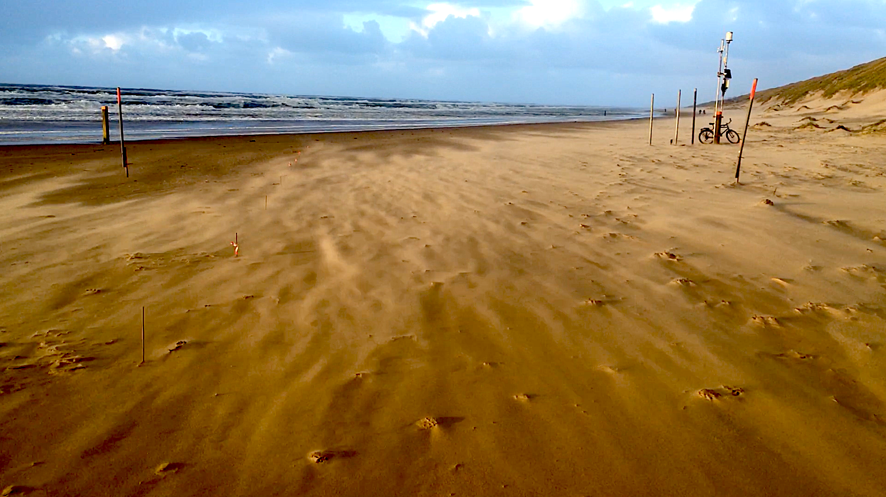

# Aeolian streamers

<p align="center">
  
  <br><b>Contrast-enhanced picture of aeolian streamers on a beach</b>
</p>

## Introduction

Trend analysis of aeolian streamer behaviour for various wind conditions by running MATLAB file "trendAnalysis.m". Solely tested on MATLAB R2019b and later versions.


### Repository version

Version 0.1.2


## Generated figures

Plot 1: Saltation intensity as a function of shear velocity.

Plot 2: Fit of plot 1 (note the logarithmic y-axis).

Plot 3: Determine height of the saltation layer.

Plot 4: Check for sensitivity equality amongst all sensors.


## Project organization

```
.
├── .gitignore
├── CITATION.md
├── LICENSE.md
├── README.md
├── requirements.txt
├── bin                <- Compiled and external code, ignored by git (PG)
│   └── external       <- Any external source code, ignored by git (RO)
├── config             <- Configuration files (HW)
├── data               <- All project data, ignored by git
│   ├── processed      <- The final, canonical data sets for modeling. (PG)
│   ├── raw            <- The original, immutable data dump. (RO)
│   └── temp           <- Intermediate data that has been transformed. (PG)
├── docs               <- Documentation notebook for users (HW)
│   ├── manuscript     <- Manuscript source, e.g., LaTeX, Markdown, etc. (HW)
│   └── reports        <- Other project reports and notebooks (e.g. Jupyter, .Rmd) (HW)
├── results
│   ├── figures        <- Figures for the manuscript or reports (PG)
│   └── output         <- Other output for the manuscript or reports (PG)
└── src                <- Source code for this project (HW)

```


## License

This project is licensed under the terms of the [MIT License](/LICENSE.md)

## Citation

Please [cite this project as described here](/CITATION.md).
